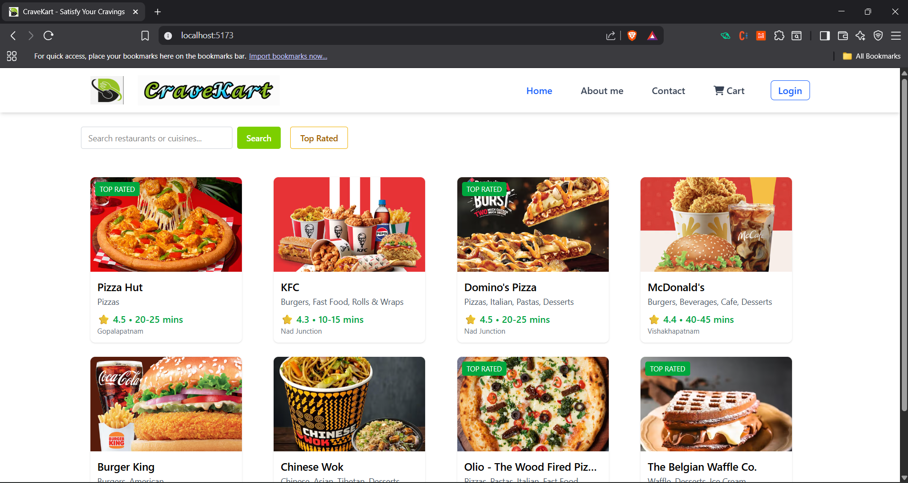
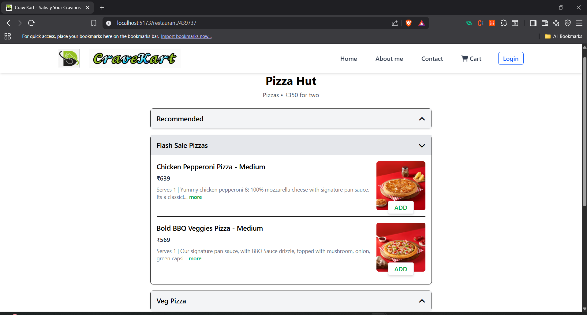
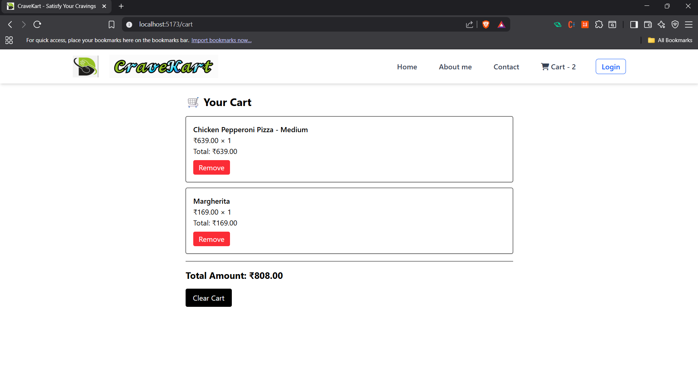

# CraveKart

A Swiggy-style food ordering frontend application built with React.js and Vite.

## 🚀 Features

-  **Restaurant Cards** with dynamic data
-  **Search Functionality** – filter restaurants by name
-  **Star Ratings & Delivery Time**
-  **Skeleton Loading (Shimmar UI)**
-  **API Integration** (with CORS proxy)
-  **Dynamic Routing** with `react-router-dom`
-  **Nested Menu Items View**
-  **Responsive Design** (mobile & desktop)
-  Clean folder structure and modular components

##  Tech Stack

| Tech          | Description                             |
|---------------|-----------------------------------------|
| React         | Frontend library                        |
| Vite          | Lightning-fast build tool               |
| Tailwind CSS  | Utility-first CSS framework             |
| react-router  | Dynamic client-side routing             |
| Swiggy API    | Real-time restaurant data (with proxy)  |

## 📸 Screenshots

### 🏠 Home Page


### 📋 Menu Page


### 🛒 Cart Page



## 📂 Folder Structure
```bash
src/
├── assets/
│   ├── logo.png
│   └── react.svg
├── components/
│   ├── Body.jsx
│   ├── data.js
│   ├── Header.jsx
│   ├── RestaurantCard.jsx
│   └── StarRatingIcon.jsx
├── App.jsx
├── index.css
├── main.jsx


## Run Locally
```bash
npm install
npm run dev
